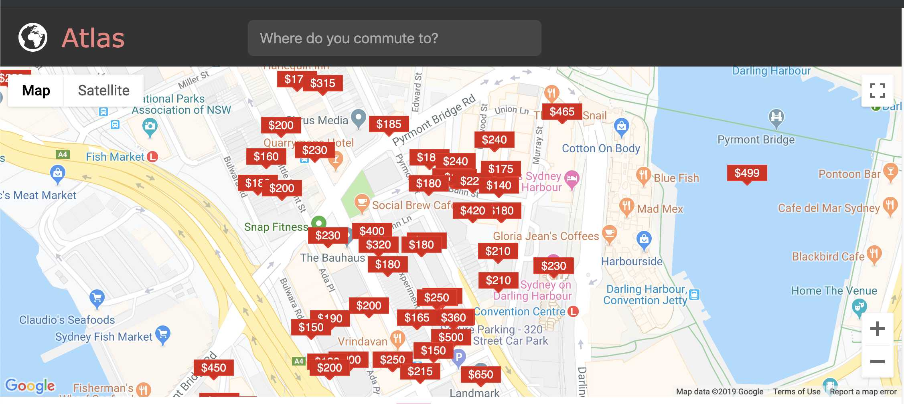
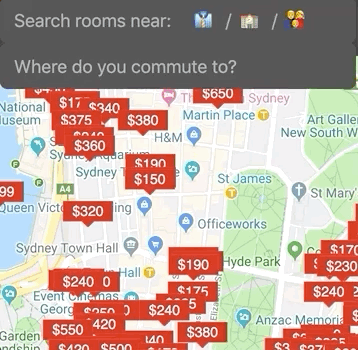

# Atlas

*Atlas* is a web application which allows users to query rental listings on
[flatmates.com.au](https://flatmates.com.au), and see the impact that living at
that listing would have on their daily commute to work, university, friends, or
family.

The application uses the following public endpoints from flatmates.com.au,
Google Transit, and Google Places:

* **[POST] flatmates.com.au/map_markers**

The Flatmates Map Markers API accepts a bounding box of latitude and longitude
coordinates, and returns a collection of rental listings, including approximate
latitude and longitude, weekly rent, a description and header image. Search 
criteria may be refined to a rent price range, private or shared room,
apartment or house, ensuite or regular bathroom, and on-street or off-street
parking.

* **[GET] maps.googleapis.com/maps/api/distancematrix**

The Distance Matrix API accepts a list of origins and a list of destinations
and returns travel time estimates for each origin-destination pair. The search
may be parameterised on method of travel, eg. driving, cycling, public transit.
If public transit is selected, the preferred mode of transitl, ie. bus or rail
may be specified as an additional dimension.

* **[GET] maps.googleapis.com/maps/api/place/autocomplete**

[Place Autocomplete Documentation](https://developers.google.com/places/web-service/autocomplete)

Place Autocomplete accepts a text query returns a list of `place id`s for relevant locations.
  This can include residential addresses, businesses, landmarks, train stations and public transit
  locations, or entire suburbs / municipalities.

* **[GET] maps.googleapis.com/maps/api/place/details/:id**

[Place Details Documentation](https://developers.google.com/places/web-service/details)

Place Details accepts a `place id` and returns information about that location,
eg. latitude and longitude coordinates, and street address.

## User stories
1) As a potential tenant, I want to find rental accommodation `costing between
$x-$y per week`, which is less than `z mins` `cycling time` from my place of work.

2) As a potential tenant, I want to find rental accommodation in an `apartment`,
which is less than `x minutes` by `bus` to my child's high school.

The Google Places API will be used to provide a user-friendly search interface
for destinations, see below. Once a destination is selected, the map 
(Google Maps Javascript SDK) will centre on that location and show
available listings, filtered by user's search criteria. A user may click on
listing markers on the map to see listing details, including travel time by
their transit mode criteria.

## Architecture
The application backend is deployed as a Docker container onto a single EC2
instance in a public subnet. The web server itself is a Node.js application
written in Typescript, using Express middleware for request routing.

The application frontend is vanilla HTML and CSS, with Typescript. Using
a very simple state machine to manage components and user flow through
the application.

The backend exposes three primary endpoints to the web frontend:

* **[GET] /google/places-autocomplete/:query**

Accepts a query string and returns a maximum of 5 autocomplete location
suggestions which include a description and latitude-longitude coordinates.

This endpoint makes requests to [Google Place Autocomplete](https://developers.google.com/places/web-service/autocomplete)
[Google Place Details](https://developers.google.com/places/web-service/details)
on the backend to fulfill the autocomplete request.

* **POST /flatmates/listings**

Accepts a lat-long bounding box, as well as rental listing criteria, to return
flatmates listings. On the backend this base request is chunked into many
smaller bounding box requests (and carefully rate-limited to 3 requests per
second) as the flatmates listings API is not paged and returns a maximum of 200
results per query.
(Using POST is not technically very RESTful in this case, but URL encoding query
parameters is messy)

* **POST /google/distance-matrix**

Accepts two latitude and longitude coordinate pairs: an origin and a
destination, as well as transit mode criteria, to return the travel
time between a rental listing and a commute destination.

(Using POST is not technically very RESTful in this case, but URL encoding query
parameters is messy)
